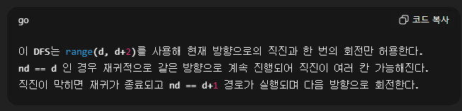

# 2105. 디저트 카페 문제


```
T = int(input())

우하, 좌하, 좌상, 우상 -> 이 순서도 중요하다. 순서가 맞아야 사각형이 만들어진다.
di = [1, 1, -1, -1]
dj = [1, -1, -1, 1]
```


```
for tc in range(1, T + 1):
    N = int(input())
    dessert = [list(map(int, input().split())) for _ in range(N)]

    ans = -1

    for i in range(N):
        for j in range(N):
            si, sj = i,j # 현위치
            eaten = {dessert[i][j]}
            dfs(i, j, 0, 1)

    print(f'#{tc} {ans}')
    
```
- ### N x N 만큼의 list를 부여하고 그 list를 하나하나 순회 하면서 i,j에서 출발하는 사각형이 되는지 dfs함수를 실행.
- ### 또한, 그 위치를 지나갔다 -> 해당 위치의 디저트를 먹었다 -> set에 등록 
- ### list를 안쓰는 이유? -> GPT 피셜 같은 기능이지만 시간을 단축시킬수 있대서

```
i : 현 위치 (행)
j : 현 위치 (열)
d : 방향.
cnt : 정답(디저트를 먹은 횟수)

def dfs(i, j, d, cnt):
    global ans, si, sj
    for nd in range(d, d+2):   # 방향은 현재 방향 이상만
        
        # 우리가 고려해야할 사항
        # 1. 회전을 다 했는가?
        # 2. 이동후에 위치가 벽 밖인가?
        # 3. 이동한위치의 디저트가 이미 먹은 디저트인가? 
        # 4. 성공의 조건 이후 탈출은 어떻게?

        # 1. 아직 회전을 끝내지 않았다면 계속해라 
        if nd>= 4:
            continue 

        ni = i + di[nd]
        nj = j + dj[nd]

        # 2. 이동해도 벽 안이라면 진행시켜라
        if ni < 0 or nj < 0 or ni >= N or nj >= N:
            continue

        # 4.시작점으로 돌아온 경우 (성공)
        if ni == si and nj == sj and nd==3 : # 시작점이고, 회
            ans = max(ans, cnt)
            return

        # 이미 먹은 디저트면 못 감
        if dessert[ni][nj] in eaten:
            continue

        eaten.add(dessert[ni][nj]) 
        dfs(ni, nj, nd, cnt+1)
        eaten.remove(dessert[ni][nj])
```
```
첫 예제 기준. 가장자리는 절대 돌아올수 없으므로 [0][1]을 기준으로 설명.
i,j는 8이고, dfs(0,1,0,1) cnt:1 인이유는 먹으면서 시작하기 때문.
nd=0 이므로 ni = i + 1, nj = j + 1 이므로, 1,2 탐색 -> 9 -> 조건문 모두 통과 -> 여기서 eaten = (8 , 9)
다음 dfs 재귀. (dfs(1,2,1,2)) 반복.
```

## 그렇다면 어떻게 한 방향으로 2번가는 큰 직사각형을 만들어내지 ?
range(d,d+2) 와 dfs(.... cnt+1) 이 핵심임. nd == 직진이고, nd == d+1 이 1회 회전.
