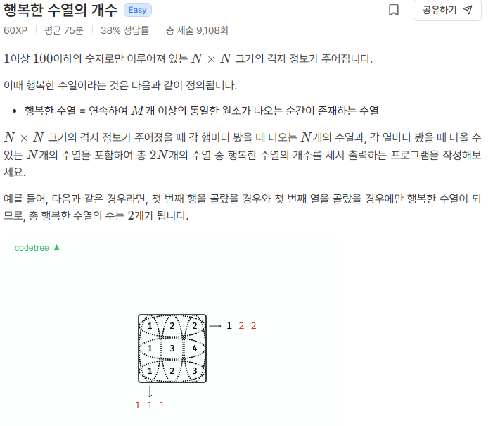

# 행복한 수열 
```
n, m = map(int, input().split())
grid = [list(map(int, input().split())) for _ in range(n)]

ans = 0
def check(arr):
    global ans
    for i in range(n-m+1):
        stack = 0
        for j in range(m):
            if arr[i] == arr[i+j]:
                stack += 1
        if stack == m:
            ans += 1
            break

for i in range(n):
    arr = grid[i]
    check(arr)

for j in range(n):
    arr = [grid[i][j] for i in range(n)] 
    check(arr)

print(ans)
```
### A형 대비 문제의 활주로 건설에서 행/열순회 아이디어를 얻었다.

### "M개이상의 동일원소를 발견할때" 가 조건이므로, 행열순회를 하면서 M만큼 탐색을 하는 방식으로 진행.

### 현위치와 다음이 같다면 정답스택을 +1 하고, 정답스택이 M 까지 올라가면 그 즉시 계산중지.
### 이미 그 행/열에는 행복한 수열이 있다고 연산이 완료 되었으므로 이후 탐색은 진행하지 않는다. -> 시간&메모리절약

